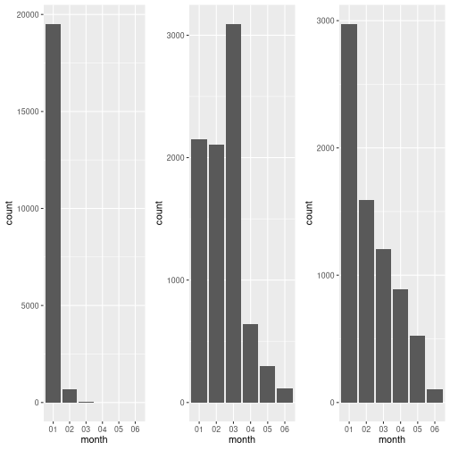
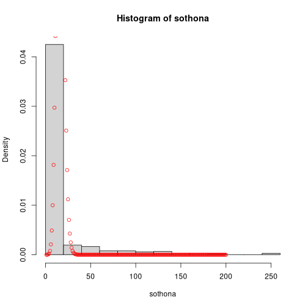

# IRIS data

We will investigate the relationship between sepal and petal dimensions using a scatterplot. We begin by loading necessary libraries and data


``` r
library(ggplot2)
library(patchwork)
library(cowplot)
```

```
## 
## Attaching package: 'cowplot'
```

```
## The following object is masked from 'package:lubridate':
## 
##     stamp
```

```
## The following object is masked from 'package:patchwork':
## 
##     align_plots
```

``` r
iris_data <- read.csv("IRIS.csv")

colour_values =  c("Iris-setosa" = "blue", "Iris-versicolor" = "green", "Iris-virginica" = "red")

length_plot <- ggplot(data = iris_data, aes(x = sepal_length, y = petal_length, col = species)) + scale_color_manual(values = colour_values) + geom_point(show.legend = FALSE) + theme_classic()

width_plot <- ggplot(data = iris_data, aes(x = sepal_width, y = petal_width, col = species)) + scale_color_manual(values = colour_values) + geom_point() + theme_classic()
length_plot + width_plot
```


By visual inspection of the figure it looks like there is a linear relationship between sepal length and petal length for Iris-virginica and Iris-versicolor, and no relationship for Iris-setosa. The same holds for sepal width and petal width, except the relationship looks weaker.

We will now investigate the distributions of these four variables


``` r
sepal_width_histogram <- ggplot(data = iris_data, aes(x = species, y = sepal_width,fill=species)) + geom_boxplot(show.legend = FALSE)
sepal_length_histogram <- ggplot(data = iris_data, aes(x = species, y = sepal_length,fill=species)) + geom_boxplot(show.legend = FALSE)
petal_width_histogram <- ggplot(data = iris_data, aes(x = species, y = petal_width,fill=species)) + geom_boxplot(show.legend = FALSE)
petal_length_histogram <- ggplot(data = iris_data, aes(x = species, y = petal_length,fill=species)) + geom_boxplot(show.legend = FALSE)
(sepal_width_histogram + sepal_length_histogram) / (petal_width_histogram + petal_length_histogram)
```


From this figure we conclude that iris-setosa has lower variance in petal width and petal length

We will now generate a pairs plot for all variables


``` r
plots <- c()
for(i in 1:4) {
  local_plot <- ggplot()
  local_plots <- c()
  for(j in 1:4) {
    
    x_name = names(iris_data)[i]
    y_name = names(iris_data)[j]
    base_plot <- ggplot()
    if(i == j) {
        base_plot <- ggplot(data = iris_data, aes(y = .data[[y_name]], col = species)) +  
          geom_density(alpha = 0.7, show.legend = FALSE) + coord_flip()
    }
    else {
          base_plot <- ggplot(data = iris_data, aes(x = .data[[x_name]], y = .data[[y_name]], col =             species)) + geom_point(show.legend = FALSE)
    }
    local_plots[[j]] <- base_plot
  }
  local_plot <- plot_grid(local_plots[[1]], local_plots[[2]], local_plots[[3]], local_plots[[4]], ncol = 4)
  plots[[i]] <- local_plot
}
plot <- plot_grid(plots[[1]], plots[[2]], plots[[3]], plots[[4]], nrow = 4)
plot
```


From this plot we can draw the conclusion that sepal length and width has a positive linear relationship for all species, petal length and petal width has a general linear trend that looks similar across all species and that the variance of petal length and width is low for Iris Setosa

# Artportalen

We will begin by loading data from Artportalen


``` r
library(tidyverse)
artportalen <- read.csv("artportalen.csv")

artportalen <- artportalen %>% mutate(Antal = ifelse(is.na(as.numeric(Antal)),1, as.numeric(Antal)))
```

```
## Warning: There were 2 warnings in `mutate()`.
## The first warning was:
## ℹ In argument: `Antal = ifelse(is.na(as.numeric(Antal)), 1, as.numeric(Antal))`.
## Caused by warning in `ifelse()`:
## ! NAs introduced by coercion
## ℹ Run `dplyr::last_dplyr_warnings()` to see the 1 remaining warning.
```

``` r
species_counts <- artportalen %>% group_by(Artnamn) %>% summarise(count = sum(Antal))
sorted_species_counts <- species_counts[order(-species_counts$count),]
most_common_species <- sorted_species_counts[1:3,]
rarest_species <- sorted_species_counts[sorted_species_counts$count == 1,]
most_common_species
```

```
## # A tibble: 3 × 2
##   Artnamn   count
##   <chr>     <dbl>
## 1 Grönsiska 20237
## 2 Sothöna    8393
## 3 Gräsand    7296
```

``` r
rarest_species
```

```
## # A tibble: 20 × 2
##    Artnamn                   count
##    <chr>                     <dbl>
##  1 Bivråk                        1
##  2 Bändelkorsnäbb                1
##  3 Ejder                         1
##  4 Fjällvråk                     1
##  5 Forsärla                      1
##  6 Gravand                       1
##  7 Lappsparv                     1
##  8 Ob. korsnäbb                  1
##  9 Ormvråk, underarten buteo     1
## 10 Rosenfink                     1
## 11 Röd glada                     1
## 12 Rödbena                       1
## 13 Spillkråka                    1
## 14 Storlom                       1
## 15 Strömstare                    1
## 16 Tornfalk                      1
## 17 Trädlärka                     1
## 18 Varfågel                      1
## 19 Vinterhämpling                1
## 20 Ägretthäger                   1
```

``` r
monthly_distribution <- artportalen %>% filter(Artnamn %in% most_common_species$Artnamn) %>% mutate(month = format(as.Date(Startdatum), "%m")) %>% group_by(Artnamn, month) %>% summarise(count = n())
```

```
## `summarise()` has grouped output by 'Artnamn'. You can override using the `.groups` argument.
```

``` r
blames_distr <- monthly_distribution %>% filter(Artnamn == "Grönsiska")
koltrast_distr <- monthly_distribution %>% filter(Artnamn == "Sothöna")
talgoxe_distr <- monthly_distribution %>% filter(Artnamn == "Gräsand")
blames_plot <- ggplot(blames_distr, aes(x = month, y = count)) + geom_bar(stat="identity")
koltrast_plot <- ggplot(koltrast_distr, aes(x = month, y = count)) + geom_bar(stat="identity")
talgoxe_plot <- ggplot(talgoxe_distr, aes(x = month, y = count)) + geom_bar(stat="identity")
plot_grid(blames_plot, koltrast_plot, talgoxe_plot, ncol = 3)
```



Grönsiska, Sothöna and Gräsand are the three most common species. The rarest species are seen in the table rarest_species.

Now we will come up with three questions of our own. One interesting question would be: What distribution do the three most common species follow?


``` r
sothona <- artportalen[artportalen$Artnamn == "Sothöna",]$Antal
gronsiska <- artportalen[artportalen$Artnamn == "Grönsiska",]$Antal
grasand <- artportalen[artportalen$Artnamn == "Gräsand",]$Antal
hist(sothona, prob = TRUE)
k = 1:200
pdf = dpois(k,mean(sothona))
points(k, pdf, col="red")
```



``` r
hist(gronsiska, prob = TRUE)
k = 1:200
pdf = dpois(k,mean(gronsiska))
points(k, pdf, col="red")
```


``` r
hist(grasand, prob = TRUE)
k = 1:200
pdf = dpois(k,mean(grasand))
points(k, pdf, col="red")
```


A Poission distribution is a poor fit for Sothöna, Grönsiska, Gräsand, probably since there is a large concentration at n = 1 for observations and a large tail. We will also investigate which species are the most overrepresented in Stockholm


``` r
stockholm_species_counts <- artportalen %>% filter(Kommun == "Stockholm") %>% group_by(Artnamn) %>% summarise(stockholm_count = sum(Antal))
merged_frame <- merge(species_counts, stockholm_species_counts)
merged_frame$stockholm_share <- merged_frame$stockholm_count / merged_frame$count
merged_frame <- merged_frame %>% filter(count != 1)
sort_stockholm_share <- merged_frame[order(-merged_frame$stockholm_share),]
sort_stockholm_share[1:40,]
```

```
##                   Artnamn count stockholm_count stockholm_share
## 6                 Bläsand   108             108       1.0000000
## 7                 Bläsgås    40              40       1.0000000
## 9            Brun kärrhök     3               3       1.0000000
## 11            Buskskvätta     7               7       1.0000000
## 16          Enkelbeckasin   169             169       1.0000000
## 18        Europeisk skata     4               4       1.0000000
## 20              Fiskgjuse     2               2       1.0000000
## 24                    Gök     7               7       1.0000000
## 27     Grågås x kanadagås     4               4       1.0000000
## 35               Grönbena    36              36       1.0000000
## 46               Hussvala     8               8       1.0000000
## 50            Kärrsångare     6               6       1.0000000
## 61               Lärkfalk     2               2       1.0000000
## 62            Ljungpipare     2               2       1.0000000
## 64              Måsfåglar   200             200       1.0000000
## 65            Mellanskarv   200             200       1.0000000
## 72        Nordlig gulärla     2               2       1.0000000
## 73        Nordsjösilltrut     2               2       1.0000000
## 76           Ob. ansergås    56              56       1.0000000
## 77       Ob. bo-/bergfink    14              14       1.0000000
## 78  Ob. fisk-/silvertärna    12              12       1.0000000
## 79                Ob. gås     2               2       1.0000000
## 84                Prutgås    40              40       1.0000000
## 92                 Sädgås    30              30       1.0000000
## 99            Silvertärna     3               3       1.0000000
## 111              Snösparv    13              13       1.0000000
## 114         Spetsbergsgås     2               2       1.0000000
## 119           Stenskvätta    54              54       1.0000000
## 127      Svarthakedopping   117             117       1.0000000
## 144          Tundrasädgås     3               3       1.0000000
## 145            Vattenrall    14              14       1.0000000
## 103               Skedand   138             136       0.9855072
## 3                Bergfink   489             481       0.9836401
## 28               Gråhäger  2328            2261       0.9712199
## 19                  Fasan    53              51       0.9622642
## 26                 Grågås  1768            1701       0.9621041
## 136              Tofsvipa   759             724       0.9538867
## 33               Gråsparv  1545            1468       0.9501618
## 69    Mindre strandpipare    17              16       0.9411765
## 39              Grönsiska 20237           18801       0.9290409
```

There are a lot of species that have only been observed in Stockholm.

Finally we check if Benfords law is a good fit for total counts


``` r
sorted_species_counts$first_digit <- floor(sorted_species_counts$count / 10^(floor(log10(sorted_species_counts$count))))
hist(sorted_species_counts$first_digit)
```


We do not obtain a Benford distribution, despite the values having a range spanning several orders of magnitude. Perhaps people hap-hazardly just put in "1000" for "A huge flock"

# Stroke data

We begin by loading stroke data


``` r
stroke_data <- read.csv("stroke-data.csv")
head(stroke_data)
```

```
##      id gender age hypertension heart_disease ever_married     work_type Residence_type
## 1  9046   Male  67            0             1          Yes       Private          Urban
## 2 51676 Female  61            0             0          Yes Self-employed          Rural
## 3 31112   Male  80            0             1          Yes       Private          Rural
## 4 60182 Female  49            0             0          Yes       Private          Urban
## 5  1665 Female  79            1             0          Yes Self-employed          Rural
## 6 56669   Male  81            0             0          Yes       Private          Urban
##   avg_glucose_level  bmi  smoking_status stroke
## 1            228.69 36.6 formerly smoked      1
## 2            202.21  N/A    never smoked      1
## 3            105.92 32.5    never smoked      1
## 4            171.23 34.4          smokes      1
## 5            174.12   24    never smoked      1
## 6            186.21   29 formerly smoked      1
```


``` r
nrow(stroke_data)
```

```
## [1] 5110
```

``` r
nrow(stroke_data[stroke_data$gender == "Other",])
```

```
## [1] 1
```

Our dataset is quite large (n = 5110) observations. We have several categorical predictors of our variable of interest, some binary (ever_married) and some with several factors (work_type, gender). Three interesting questions come to mind:

A)  Is there any relationship between marriage status and stroke, and does this relationship differ by gender?

B)  Same question as A but for type of employment

C)  How well can we predict stroke?

We will create contingency tables for A and B, and use logistic regression for C


``` r
cleaned_stroke_data <- stroke_data %>% filter(gender != "Other") # Only one observation, meaningless to speak of

contingency_table_gender <- table(data.frame(cleaned_stroke_data$gender, cleaned_stroke_data$stroke))


married_stroke_data <- cleaned_stroke_data[cleaned_stroke_data$ever_married == "Yes",]
contingency_table_marriage <- table(data.frame(married_stroke_data$gender, married_stroke_data$stroke))
contingency_table_gender
```

```
##                           cleaned_stroke_data.stroke
## cleaned_stroke_data.gender    0    1
##                     Female 2853  141
##                     Male   2007  108
```

``` r
contingency_table_marriage
```

```
##                           married_stroke_data.stroke
## married_stroke_data.gender    0    1
##                     Female 1881  120
##                     Male   1252  100
```

From this we can conclude that having ever been married seems to predict lower stroke risk for women.

We now continue to employment


``` r
model <- glm(stroke ~ gender*as.factor(work_type), data = cleaned_stroke_data, family = "binomial")
summary(model)
```

```
## 
## Call:
## glm(formula = stroke ~ gender * as.factor(work_type), family = "binomial", 
##     data = cleaned_stroke_data)
## 
## Coefficients:
##                                               Estimate Std. Error z value Pr(>|z|)    
## (Intercept)                                    -5.0876     0.7093  -7.173 7.35e-13 ***
## genderMale                                    -13.4785   343.2975  -0.039 0.968682    
## as.factor(work_type)Govt_job                    2.2935     0.7411   3.095 0.001970 ** 
## as.factor(work_type)Never_worked              -13.4785  1966.6497  -0.007 0.994532    
## as.factor(work_type)Private                     1.9930     0.7189   2.772 0.005568 ** 
## as.factor(work_type)Self-employed               2.6366     0.7282   3.621 0.000294 ***
## genderMale:as.factor(work_type)Govt_job        13.0617   343.2977   0.038 0.969650    
## genderMale:as.factor(work_type)Never_worked    13.4785  2802.3693   0.005 0.996162    
## genderMale:as.factor(work_type)Private         13.8632   343.2975   0.040 0.967788    
## genderMale:as.factor(work_type)Self-employed   13.4785   343.2976   0.039 0.968682    
## ---
## Signif. codes:  0 '***' 0.001 '**' 0.01 '*' 0.05 '.' 0.1 ' ' 1
## 
## (Dispersion parameter for binomial family taken to be 1)
## 
##     Null deviance: 1990.3  on 5108  degrees of freedom
## Residual deviance: 1911.1  on 5099  degrees of freedom
## AIC: 1931.1
## 
## Number of Fisher Scoring iterations: 17
```

Who would have thought that Self-employed men suffer dramatically increased stroke risk? Well, anyone who has ever observed one in the wild.

Now lets throw in all of our variables and see how good our predictive validity can get given our dataset


``` r
set.seed(050903)
library(pROC)

stroke_data_cleaned <- stroke_data_cleaned %>% mutate(bmi = as.numeric(bmi), avg_glucose_level = as.numeric(avg_glucose_level), age = as.numeric(age), gender = as.factor(gender), ever_married = as.factor(ever_married), Residence_type = as.factor(Residence_type), smoking_status = as.factor(smoking_status)) 
```

```
## Error: object 'stroke_data_cleaned' not found
```

``` r
final_cleaned_data <- stroke_data_cleaned[complete.cases(stroke_data_cleaned),]
```

```
## Error: object 'stroke_data_cleaned' not found
```

``` r
training_indicies <- runif(nrow(final_cleaned_data)) < 0.8
```

```
## Error: object 'final_cleaned_data' not found
```

``` r
testing_indicies <- !training_indicies
```

```
## Error: object 'training_indicies' not found
```

``` r
training_data <- final_cleaned_data[training_indicies,]
```

```
## Error: object 'final_cleaned_data' not found
```

``` r
testing_data <- final_cleaned_data[testing_indicies,]
```

```
## Error: object 'final_cleaned_data' not found
```

``` r
giga_model <- glm(stroke ~ ., data = training_data, family = "binomial")
```

```
## Error in eval(mf, parent.frame()): object 'training_data' not found
```

``` r
summary(giga_model)
```

```
## Error: object 'giga_model' not found
```

``` r
predictions <- predict(giga_model, testing_data, type = "response")
```

```
## Error: object 'giga_model' not found
```

``` r
ggroc(roc(testing_data$stroke, predictions))
```

```
## Error: object 'testing_data' not found
```

Our ROC curve looks good but not great. Also, since we have major class imbalance (minority class being strokes) we probably have an even worse precision-recall metric :/

# Cleaning data

AGGGGGGHHHHHHHHHHHHHHHHHHHHHHHHHHHHHHHHHHHHHHHHH

A lot of countries have NA between 1965 and 1970 as well as between 1970 and 1975, where they have zero cell phones. It seems quite reasonable that if the amount of cell phones was 0 in 1970 and 0 in 1975 it was probably 0 in the years in between. So this is the first thing we handle


``` r
cell_phone_data <- read.csv("cell_phones_total.csv")

na_to_zero_pre_1975 <- function(row) {
  fixed_row = row
  for(i in 2:13) {
    if(is.na(row[i])) {
      fixed_row[i] = 0
    }
  }
  
 return(fixed_row) 
}

pre_1975_na_fixed <- cell_phone_data

for(i in 1:nrow(cell_phone_data)) {
  pre_1975_na_fixed[i,] <- na_to_zero_pre_1975(pre_1975_na_fixed[i,])
}
```

Now we need to fix the "k, M, B" problem and add "missing" when an entry is missing (instead of null)


``` r
fix_kmb_problem <- function(row) {
  fixed_row = row
  for(i in 2:length(row)) {
    if(grepl("k",row[i])) {
      fixed_row[i] <- as.numeric(gsub("k","",row[i]))*1000
    }
    else if(grepl("M",row[i])) {
      fixed_row[i] <- as.numeric(gsub("M","",row[i]))*1000*1000
    }
    else if(grepl("B",row[i])) {
      fixed_row[i] <- as.numeric(gsub("B","",row[i]))*1000*1000*1000
    }
    if(!is.na(row[i]) && row[i] == "") {
      fixed_row[i] = "missing"
    }
  }
  return(fixed_row)
}

kmb_fixed <- pre_1975_na_fixed

for(i in 1:nrow(cell_phone_data)) {
  kmb_fixed[i,] <- fix_kmb_problem(pre_1975_na_fixed[i,])
}
head(kmb_fixed)
```

```
##   iso.3 X1960 X1965 X1966 X1967 X1968 X1969 X1970 X1971 X1972 X1973 X1974 X1975 X1976 X1977 X1978
## 1   ABW     0     0     0     0     0     0     0     0     0     0     0     0     0     0     0
## 2   AFG     0     0     0     0     0     0     0     0     0     0     0     0     0     0     0
## 3   AGO     0     0     0     0     0     0     0     0     0     0     0     0     0     0     0
## 4   ALB     0     0     0     0     0     0     0     0     0     0     0     0     0     0     0
## 5   AND     0     0     0     0     0     0     0     0     0     0     0     0     0     0     0
## 6   ARE     0     0     0     0     0     0     0     0     0     0     0     0    NA    NA    NA
##   X1979   X1980   X1981 X1982 X1983 X1984 X1985 X1986 X1987 X1988 X1989 X1990 X1991 X1992   X1993
## 1     0       0       0     0     0     0     0     0     0     0     0     0     0    20 missing
## 2     0       0       0     0     0     0     0     0     0     0     0     0     0     0       0
## 3     0       0       0     0     0     0     0     0     0     0     0     0     0     0    1100
## 4     0       0       0     0     0     0     0     0     0     0     0     0     0     0       0
## 5     0       0       0     0     0     0     0     0     0     0     0     0     0   770     780
## 6    NA missing missing  2330  3560  4940  7920 11200 13700 13800 24900 33600 43000 48900   70600
##     X1994  X1995  X1996  X1997  X1998  X1999   X2000   X2001   X2002   X2003   X2004   X2005   X2006
## 1 missing   1720   3000   3400   5380  12000   15000   53000   61800   70000   98400  103000  109000
## 2       0      0      0      0      0      0       0       0   25000   2e+05   6e+05 1200000 2520000
## 3    1820   1990   3300   7050   9820  24000   25800   75000  140000  350000  740000 1610000 3050000
## 4       0      0   2300   3300   5600  11000   29800  393000  851000 1100000 1260000 1530000 1910000
## 5     784   2830   5490   8620  14100  20600   23500   29400   32800   51900   58400   64600   69000
## 6   91500 129000 194000 309000 493000 832000 1430000 1910000 2430000 2970000 3680000 4530000 5520000
##     X2007   X2008    X2009    X2010    X2011    X2012    X2013    X2014    X2015    X2016    X2017
## 1  114000  121000   128000   132000  missing   135000   139000   140000   141000  missing  missing
## 2 4670000 7900000 10500000 10200000 13800000 15300000 16800000 18400000 19700000 21600000 23900000
## 3 4960000 6770000  8110000  9400000 12100000 12800000 13300000 14100000 13900000  1.3e+07 13300000
## 4 2320000 1860000  2460000  2690000  3100000  3500000  3690000  3360000  3400000  3370000  3630000
## 5   63500   64200    64500    65500    65000    63900    63900    66200    71300    76100    80300
## 6 7730000 9360000 10700000 10900000 11700000 13800000 16100000 16800000 17900000 19900000 19800000
##      X2018    X2019
## 1  missing  missing
## 2  2.2e+07 22600000
## 3 13300000 14800000
## 4  2710000  2630000
## 5    82600    87900
## 6 20100000 19600000
```

Now we have cleaned the data
