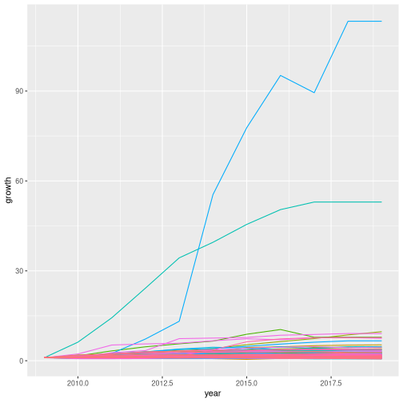
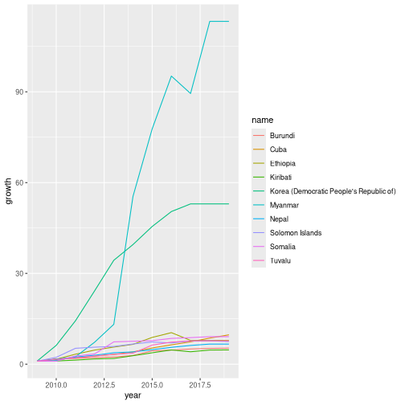

# Homework 4

## Joining data

we begin by loading necessary libraries and data


``` r
library(tidyverse)
library(ggplot2)
population_data <- read.csv("pop_data.csv") %>% select(!X)
phone_data <- read.csv("cell_phone_data_cleaned.csv") %>% select(!X)
```

We now pivot the data frames and rename their fields so that we can merge them


``` r
pivoted_population_data <- population_data %>% pivot_longer(!iso.3) %>% mutate(population = value) %>% select(!value)
pivoted_phone_data <- phone_data %>% pivot_longer(!iso.3) %>% mutate(cell_phones = value) %>% select(!value)
naming_data <- read.csv("country_data.csv") %>% select(name, alpha.3) %>% mutate(iso.3 = alpha.3) %>% select(!alpha.3)
```

We now merge the the population, name and cell-phone data, first by merging population and phone data and then by performing a lookup mapping iso3 code -\> name. Finally we re-name columns, select only the ones we are interested in, pivot wider and replace all NAs by -1. We treat all NAs the same since the data was cleaned in HW3 in such a way that it makes sense to treat all NAs the same. We replace with -1 since this obviously means missing data (it can't be a real datapoint since a per capita number is always non-negative) and since tidyverse will not allow us to fill a string in a numeric field


``` r
merged_data <- merge(pivoted_population_data, pivoted_phone_data) %>% mutate(phones_per_capita = cell_phones / population)

named_merged_data <- inner_join(naming_data, merged_data, by = "iso.3") %>% mutate(year = name.y, name = name.x, value = phones_per_capita) %>% select(name, year, phones_per_capita, value) %>% replace(is.na(.), -1) %>% mutate(year = as.numeric(gsub("[^0-9.-]","",year))) %>% select(name, year, value)

pivoted_merged_data <- named_merged_data %>% pivot_wider(id_cols = year)
```

We now wish to visualise the growth rate of phones per capita in the different countries over the past ten years. Since we do not have data from after 2019 I interpret this assignment as asking us to visualise data in the range 2009 - 2019


``` r
ten_year_data <- named_merged_data[named_merged_data$year >= 2009,]

ten_year_data$growth <- rep(0, nrow(ten_year_data))

for(i in 1:nrow(ten_year_data)) {
  name <- ten_year_data[i,1]
  starting_value <- ten_year_data[ten_year_data$name == name,3][1]
  growth <- ten_year_data[i,3] / starting_value
  ten_year_data$growth[i] <- growth
  if(growth < 0) {
    ten_year_data$growth[i] <- ten_year_data$growth[i-1]
  }
}


ggplot(ten_year_data, aes(x = year, y = growth, color = name)) + geom_line(show.legend = FALSE) 
```



We can not plot the legend here, since it would be to cluttered. Instead, we plot a subset of countries that grew fast


``` r
growth_2019 <- ten_year_data[ten_year_data$year == 2019,]

fast_growers <- growth_2019[order(-growth_2019$growth)[1:10],]$name

fast_grower_data <- ten_year_data[ten_year_data$name %in% fast_growers,]

ggplot(fast_grower_data, aes(x = year, y = growth, color = name)) + geom_line() 
```



From this plot we can clearly see that Myanmar has had the fastest growth in cell phones per capita. 

## SQL

In this part of the assignment we will be working with an SQL database. We first find all users that signed up


``` r
library("RSQLite")
db <- dbConnect(drv=RSQLite::SQLite(), dbname="user_actions.db") 

signed_up_users <- dbFetch(dbSendQuery(db, "SELECT DISTINCT username FROM user_actions WHERE action = 'signup'"))
signed_up_users
```

```
##    username
## 1    user34
## 2    user28
## 3     user1
## 4    user24
## 5    user15
## 6    user20
## 7    user18
## 8    user25
## 9     user3
## 10    user9
## 11   user27
## 12   user16
## 13   user17
## 14    user4
## 15    user8
## 16   user13
## 17   user19
## 18   user31
## 19   user10
## 20   user23
## 21   user11
## 22   user33
## 23   user12
## 24   user29
## 25   user21
## 26    user6
## 27   user14
## 28   user30
## 29    user7
## 30   user26
## 31   user22
## 32    user5
## 33   user35
## 34    user2
## 35   user32
```
Now we will compute the total number of log entries for each user


``` r
actions_by_user_query <- dbSendQuery(db, "SELECT user_id, username, COUNT(*) as action_count FROM user_actions GROUP BY user_id")
```

```
## Warning: Closing open result set, pending rows
```

``` r
actions_by_user <- dbFetch(actions_by_user_query)
actions_by_user
```

```
##    user_id username action_count
## 1        1    user1          104
## 2        2    user2          149
## 3        3    user3          108
## 4        4    user4          436
## 5        5    user5          192
## 6        6    user6          457
## 7        7    user7          362
## 8        8    user8          329
## 9        9    user9          118
## 10      10   user10          170
## 11      11   user11          328
## 12      12   user12          209
## 13      13   user13          470
## 14      14   user14          320
## 15      15   user15           35
## 16      16   user16          379
## 17      17   user17          367
## 18      18   user18          122
## 19      19   user19           58
## 20      20   user20          362
## 21      21   user21          323
## 22      22   user22          275
## 23      23   user23          309
## 24      24   user24          162
## 25      25   user25          136
## 26      26   user26          217
## 27      27   user27          211
## 28      28   user28           91
## 29      29   user29           49
## 30      30   user30          165
## 31      31   user31          389
## 32      32   user32           32
## 33      33   user33           32
## 34      34   user34          180
## 35      35   user35          394
```

Finally we will find all users that signed up and logged in on the same day


``` r
dbExecute(db, "DROP TABLE signup")
```

```
## Warning: Closing open result set, pending rows
```

```
## [1] 0
```

``` r
dbExecute(db, "ALTER TABLE user_actions DROP COLUMN date")
```

```
## [1] 0
```

``` r
dbExecute(db, "ALTER TABLE user_actions ADD COLUMN date")
```

```
## [1] 0
```

``` r
dbExecute(db, "UPDATE user_actions set date = strftime('%Y-%m-%d', timestamp)")
```

```
## [1] 8040
```

``` r
dbExecute(db, "CREATE TABLE signup AS SELECT username, date AS signup_date FROM user_actions WHERE action = 'signup'")
```

```
## [1] 0
```

``` r
same_day_query <- dbSendQuery(db, "SELECT DISTINCT username, user_id FROM (SELECT user_id, username FROM (SELECT * from signup s1, user_actions s2 WHERE s1.signup_date = s2.date) WHERE action = 'login')")
same_day_results <- dbFetch(same_day_query)
same_day_results
```

```
##    username user_id
## 1    user15      27
## 2    user25      23
## 3     user3      24
## 4    user16      17
## 5     user4      23
## 6     user4      26
## 7     user8       8
## 8    user13      23
## 9    user19       8
## 10   user31      27
## 11   user31      23
## 12   user10       9
## 13   user10      17
## 14   user23       9
## 15   user11      17
## 16   user11      27
## 17   user33      16
## 18   user33      24
## 19   user33       7
## 20   user12      12
## 21   user12      16
## 22   user12      27
## 23   user12      24
## 24   user12      30
## 25   user29      17
## 26   user29       8
## 27   user21      11
## 28   user21      14
## 29   user21      16
## 30    user6      28
## 31    user6      11
## 32    user6       5
## 33    user6       2
## 34    user6      23
## 35   user14      11
## 36   user14      22
## 37   user14      10
## 38   user14       5
## 39   user14      16
## 40   user14      20
## 41   user30      17
## 42   user30      13
## 43   user30      16
## 44   user30      30
## 45   user30      22
## 46    user7      29
## 47    user7      20
## 48    user7      13
## 49    user7       7
## 50    user7       6
## 51   user26      16
## 52   user26      30
## 53   user26       6
## 54   user22      29
## 55   user22      22
## 56   user22       5
## 57   user22      27
## 58   user22      20
## 59   user22      21
## 60    user5       9
## 61    user5      25
## 62    user5       4
## 63    user5      13
## 64    user5       5
## 65    user5      21
## 66    user5      20
## 67    user5       6
## 68    user5      11
## 69   user35      28
## 70   user35      21
## 71   user35      34
## 72   user35       4
## 73   user35       5
## 74   user35      11
## 75   user35      12
## 76   user35       6
## 77    user2      11
## 78    user2      34
## 79    user2      29
## 80    user2       9
## 81    user2      21
## 82    user2       5
## 83    user2       1
## 84    user2      13
## 85    user2       4
## 86    user2       2
## 87    user2      14
## 88    user2      12
## 89    user2       6
## 90   user32      31
## 91   user32      34
## 92   user32      25
## 93   user32      32
## 94   user32      21
## 95   user32       4
## 96   user32       1
## 97   user32      20
```
## Regex

We will be extracting hashtags from a given comment and matching comments containing #python #programming or #programming #python


``` r
hashtag_matcher <- "#(.*?)(?= )|#(.*?)(?=\")"
python_programming_matcher <- "(#python #programming\"|#programming #python\")"
str_extract_all("\"Today I am a programmer #programming #tips\"",hashtag_matcher)
```

```
## [[1]]
## [1] "#programming" "#tips"
```

``` r
str_detect(python_programming_matcher, "\"Enjoyed the article. #coding #python\"")
```

```
## [1] FALSE
```

Our regex works as expected
