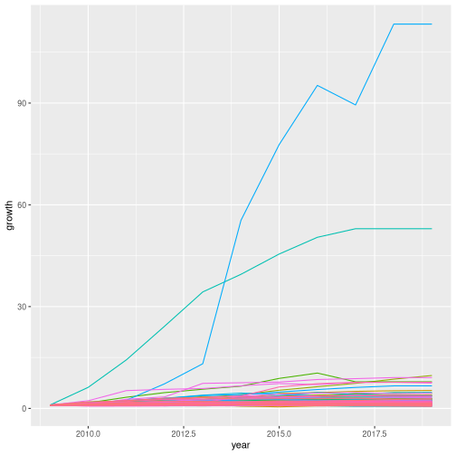

# Homework 4

## Joining data

we begin by loading necessary libraries and data


``` r
library(tidyverse)
```

```
## ── Attaching core tidyverse packages ────────────────────────────────────────────────────────────────────────────────────────── tidyverse 2.0.0 ──
## ✔ dplyr     1.1.4     ✔ readr     2.1.5
## ✔ forcats   1.0.0     ✔ stringr   1.5.1
## ✔ ggplot2   3.5.1     ✔ tibble    3.2.1
## ✔ lubridate 1.9.3     ✔ tidyr     1.3.1
## ✔ purrr     1.0.2     
## ── Conflicts ──────────────────────────────────────────────────────────────────────────────────────────────────────────── tidyverse_conflicts() ──
## ✖ dplyr::filter() masks stats::filter()
## ✖ dplyr::lag()    masks stats::lag()
## ℹ Use the conflicted package (<http://conflicted.r-lib.org/>) to force all conflicts to become errors
```

``` r
library(ggplot2)
population_data <- read.csv("pop_data.csv") %>% select(!X)
phone_data <- read.csv("cell_phone_data_cleaned.csv") %>% select(!X)
```

We now pivot the data frames and rename their fields so that we can merge them


``` r
pivoted_population_data <- population_data %>% pivot_longer(!iso.3) %>% mutate(population = value) %>% select(!value)
pivoted_phone_data <- phone_data %>% pivot_longer(!iso.3) %>% mutate(cell_phones = value) %>% select(!value)
naming_data <- read.csv("country_data.csv") %>% select(name, alpha.3) %>% mutate(iso.3 = alpha.3) %>% select(!alpha.3)
```

We now merge the the population, name and cell-phone data, first by merging population and phone data and then by performing a lookup mapping iso3 code -\> name. Finally we re-name columns, select only the ones we are interested in, pivot wider and replace all NAs by -1. We treat all NAs the same since the data was cleaned in HW3 in such a way that it makes sense to treat all NAs the same. We replace with -1 since this obviously means missing data (it can't be a real datapoint since a per capita number is always non-negative) and since tidyverse will not allow us to fill a string in a numeric field


``` r
to_present <- merge(pivoted_population_data, pivoted_phone_data)

merged_data <- to_present %>% mutate(phones_per_capita = cell_phones / population)
names(to_present) <- c("iso.3","year","population","n_cellphones")
to_present$year <- substr(to_present$year, 2, 5)
named_merged_data <- inner_join(naming_data, merged_data, by = "iso.3") %>% mutate(year = name.y, name = name.x, value = phones_per_capita) %>% select(name, year, phones_per_capita, value) %>% replace(is.na(.), -1) %>% mutate(year = as.numeric(gsub("[^0-9.-]","",year))) %>% select(name, year, value)

countries_to_present <- named_merged_data %>% filter(year == 2019) %>% arrange(-value) %>% top_n(10) %>% select(name)
```

```
## Selecting by value
```

``` r
pivoted_merged_data <- named_merged_data %>% filter(name %in% countries_to_present$name) %>% pivot_wider(id_cols = year) %>% arrange(-year)
pivoted_merged_data
```

```
## # A tibble: 56 × 11
##     year `Hong Kong` Kuwait Lithuania Maldives Montenegro `Russian Federation` Seychelles `South Africa` Thailand `United Arab Emirates`
##    <dbl>       <dbl>  <dbl>     <dbl>    <dbl>      <dbl>                <dbl>      <dbl>          <dbl>    <dbl>                  <dbl>
##  1  2019        2.86   1.65      1.67     1.64       1.85                 1.66       1.99          1.67      1.82                   2.13
##  2  2018        2.67   1.64      1.64     1.75       1.82                 1.59       1.85          1.61      1.76                   2.20
##  3  2017        2.49   1.73      1.54     1.90       1.67                 1.57       1.74          1.56      1.72                   2.18
##  4  2016        2.40   1.89      1.46     1.79       1.67                 1.59       1.61          1.46      1.70                   2.21
##  5  2015        2.29   1.96      1.44     1.70       1.62                 1.58       1.58          1.57      1.47                   2.01
##  6  2014        2.35   2.02      1.46     1.60       1.62                 1.54       1.65          1.45      1.39                   1.90
##  7  2013        2.37   1.76      1.55     1.56       1.60                 1.52       1.52          1.43      1.35                   1.84
##  8  2012        2.29   1.50      1.67     1.45       1.60                 1.45       1.54          1.29      1.23                   1.59
##  9  2011        2.16   1.57      1.63     1.42       1.87                 1.43       1.45          1.22      1.13                   1.36
## 10  2010        1.96   1.35      1.58     1.37       1.89                 1.67       1.31          0.973     1.05                   1.29
## # ℹ 46 more rows
```

``` r
to_present
```

```
##     iso.3 year population n_cellphones
## 1     ABW 1960      54608            0
## 2     ABW 1965      58782            0
## 3     ABW 1966      59291            0
## 4     ABW 1967      59522            0
## 5     ABW 1968      59471            0
## 6     ABW 1969      59330            0
## 7     ABW 1970      59106            0
## 8     ABW 1971      58816            0
## 9     ABW 1972      58855            0
## 10    ABW 1973      59365            0
## 11    ABW 1974      60028            0
## 12    ABW 1975      60715            0
## 13    ABW 1976      61193            0
## 14    ABW 1977      61465            0
## 15    ABW 1978      61738            0
## 16    ABW 1979      62006            0
## 17    ABW 1980      62267            0
## 18    ABW 1981      62614            0
## 19    ABW 1982      63116            0
## 20    ABW 1983      63683            0
## 21    ABW 1984      64174            0
## 22    ABW 1985      64478            0
## 23    ABW 1986      64553            0
## 24    ABW 1987      64450            0
## 25    ABW 1988      64332            0
## 26    ABW 1989      64596            0
## 27    ABW 1990      65712            0
## 28    ABW 1991      67864            0
## 29    ABW 1992      70192           20
## 30    ABW 1993      72360           NA
## 31    ABW 1994      74710           NA
## 32    ABW 1995      77050         1720
## 33    ABW 1996      79417         3000
## 34    ABW 1997      81858         3400
## 35    ABW 1998      84355         5380
## 36    ABW 1999      86867        12000
## 37    ABW 2000      89101        15000
## 38    ABW 2001      90691        53000
## 39    ABW 2002      91781        61800
## 40    ABW 2003      92701        70000
## 41    ABW 2004      93540        98400
## 42    ABW 2005      94483       103000
## 43    ABW 2006      95606       109000
## 44    ABW 2007      96787       114000
## 45    ABW 2008      97996       121000
## 46    ABW 2009      99212       128000
## 47    ABW 2010     100341       132000
## 48    ABW 2011     101288           NA
## 49    ABW 2012     102112       135000
## 50    ABW 2013     102880       139000
## 51    ABW 2014     103594       140000
## 52    ABW 2015     104257       141000
## 53    ABW 2016     104874           NA
## 54    ABW 2017     105439           NA
## 55    ABW 2018     105962           NA
## 56    ABW 2019     106442           NA
## 57    AFG 1960    8622466            0
## 58    AFG 1965    9565147            0
## 59    AFG 1966    9783147            0
## 60    AFG 1967   10010030            0
## 61    AFG 1968   10247780            0
## 62    AFG 1969   10494489            0
## 63    AFG 1970   10752971            0
## 64    AFG 1971   11015857            0
## 65    AFG 1972   11286753            0
## 66    AFG 1973   11575305            0
## 67    AFG 1974   11869879            0
## 68    AFG 1975   12157386            0
## 69    AFG 1976   12425267            0
## 70    AFG 1977   12687301            0
## 71    AFG 1978   12938862            0
## 72    AFG 1979   12986369            0
## 73    AFG 1980   12486631            0
## 74    AFG 1981   11155195            0
## 75    AFG 1982   10088289            0
## 76    AFG 1983    9951449            0
## 77    AFG 1984   10243686            0
## 78    AFG 1985   10512221            0
## 79    AFG 1986   10448442            0
## 80    AFG 1987   10322758            0
## 81    AFG 1988   10383460            0
## 82    AFG 1989   10673168            0
## 83    AFG 1990   10694796            0
## 84    AFG 1991   10745167            0
## 85    AFG 1992   12057433            0
## 86    AFG 1993   14003760            0
## 87    AFG 1994   15455555            0
## 88    AFG 1995   16418912            0
## 89    AFG 1996   17106595            0
## 90    AFG 1997   17788819            0
## 91    AFG 1998   18493132            0
## 92    AFG 1999   19262847            0
## 93    AFG 2000   19542982            0
## 94    AFG 2001   19688632            0
## 95    AFG 2002   21000256        25000
## 96    AFG 2003   22645130       200000
## 97    AFG 2004   23553551       600000
## 98    AFG 2005   24411191      1200000
## 99    AFG 2006   25442944      2520000
## 100   AFG 2007   25903301      4670000
## 101   AFG 2008   26427199      7900000
## 102   AFG 2009   27385307     10500000
## 103   AFG 2010   28189672     10200000
## 104   AFG 2011   29249157     13800000
## 105   AFG 2012   30466479     15300000
## 106   AFG 2013   31541209     16800000
## 107   AFG 2014   32716210     18400000
## 108   AFG 2015   33753499     19700000
## 109   AFG 2016   34636207     21600000
## 110   AFG 2017   35643418     23900000
## 111   AFG 2018   36686784     22000000
## 112   AFG 2019   37769499     22600000
## 113   AGO 1960    5357195            0
## 114   AGO 1965    5736582            0
## 115   AGO 1966    5787044            0
## 116   AGO 1967    5827503            0
## 117   AGO 1968    5868203            0
## 118   AGO 1969    5928386            0
## 119   AGO 1970    6029700            0
## 120   AGO 1971    6177049            0
## 121   AGO 1972    6364731            0
## 122   AGO 1973    6578230            0
## 123   AGO 1974    6802494            0
## 124   AGO 1975    7032713            0
## 125   AGO 1976    7266780            0
## 126   AGO 1977    7511895            0
## 127   AGO 1978    7771590            0
## 128   AGO 1979    8043218            0
## 129   AGO 1980    8330047            0
## 130   AGO 1981    8631457            0
## 131   AGO 1982    8947152            0
## 132   AGO 1983    9276707            0
## 133   AGO 1984    9617702            0
## 134   AGO 1985    9970621            0
## 135   AGO 1986   10332574            0
## 136   AGO 1987   10694057            0
## 137   AGO 1988   11060261            0
## 138   AGO 1989   11439498            0
## 139   AGO 1990   11828638            0
## 140   AGO 1991   12228691            0
## 141   AGO 1992   12632507            0
## 142   AGO 1993   13038270         1100
## 143   AGO 1994   13462031         1820
## 144   AGO 1995   13912253         1990
## 145   AGO 1996   14383350         3300
## 146   AGO 1997   14871146         7050
## 147   AGO 1998   15366864         9820
## 148   AGO 1999   15870753        24000
## 149   AGO 2000   16394062        25800
## 150   AGO 2001   16941587        75000
## 151   AGO 2002   17516139       140000
## 152   AGO 2003   18124342       350000
## 153   AGO 2004   18771125       740000
## 154   AGO 2005   19450959      1610000
## 155   AGO 2006   20162340      3050000
## 156   AGO 2007   20909684      4960000
## 157   AGO 2008   21691522      6770000
## 158   AGO 2009   22507674      8110000
## 159   AGO 2010   23364185      9400000
## 160   AGO 2011   24259111     12100000
## 161   AGO 2012   25188292     12800000
## 162   AGO 2013   26147002     13300000
## 163   AGO 2014   27128337     14100000
## 164   AGO 2015   28127721     13900000
## 165   AGO 2016   29154746     13000000
## 166   AGO 2017   30208628     13300000
## 167   AGO 2018   31273533     13300000
## 168   AGO 2019   32353588     14800000
## 169   ALB 1960    1608800            0
## 170   ALB 1965    1864791            0
## 171   ALB 1966    1914573            0
## 172   ALB 1967    1965598            0
## 173   ALB 1968    2022272            0
## 174   ALB 1969    2081695            0
## 175   ALB 1970    2135479            0
## 176   ALB 1971    2187853            0
## 177   ALB 1972    2243126            0
## 178   ALB 1973    2296752            0
## 179   ALB 1974    2350124            0
## 180   ALB 1975    2404831            0
## 181   ALB 1976    2458526            0
## 182   ALB 1977    2513546            0
## 183   ALB 1978    2566266            0
## 184   ALB 1979    2617832            0
## 185   ALB 1980    2671997            0
## 186   ALB 1981    2726056            0
## 187   ALB 1982    2784278            0
## 188   ALB 1983    2843960            0
## 189   ALB 1984    2904429            0
## 190   ALB 1985    2964762            0
## 191   ALB 1986    3022635            0
## 192   ALB 1987    3083605            0
## 193   ALB 1988    3142336            0
## 194   ALB 1989    3227943            0
## 195   ALB 1990    3286542            0
## 196   ALB 1991    3266790            0
## 197   ALB 1992    3247039            0
## 198   ALB 1993    3227287            0
## 199   ALB 1994    3207536            0
## 200   ALB 1995    3187784            0
## 201   ALB 1996    3168033         2300
## 202   ALB 1997    3148281         3300
## 203   ALB 1998    3128530         5600
## 204   ALB 1999    3108778        11000
## 205   ALB 2000    3089027        29800
## 206   ALB 2001    3060173       393000
## 207   ALB 2002    3051010       851000
## 208   ALB 2003    3039616      1100000
## 209   ALB 2004    3026939      1260000
## 210   ALB 2005    3011487      1530000
## 211   ALB 2006    2992547      1910000
## 212   ALB 2007    2970017      2320000
## 213   ALB 2008    2947314      1860000
## 214   ALB 2009    2927519      2460000
## 215   ALB 2010    2913021      2690000
## 216   ALB 2011    2905195      3100000
## 217   ALB 2012    2900401      3500000
## 218   ALB 2013    2895092      3690000
## 219   ALB 2014    2889104      3360000
## 220   ALB 2015    2880703      3400000
## 221   ALB 2016    2876101      3370000
## 222   ALB 2017    2873457      3630000
## 223   ALB 2018    2866376      2710000
## 224   ALB 2019    2854191      2630000
## 225   AND 1960       9443            0
## 226   AND 1965      13563            0
## 227   AND 1966      14546            0
## 228   AND 1967      15745            0
## 229   AND 1968      17079            0
## 230   AND 1969      18449            0
## 231   AND 1970      19860            0
## 232   AND 1971      21322            0
## 233   AND 1972      22832            0
## 234   AND 1973      24393            0
## 235   AND 1974      26003            0
## 236   AND 1975      27640            0
## 237   AND 1976      29294            0
## 238   AND 1977      30949            0
## 239   AND 1978      32574            0
## 240   AND 1979      34142            0
## 241   AND 1980      35611            0
## 242   AND 1981      36987            0
## 243   AND 1982      38598            0
## 244   AND 1983      40432            0
## 245   AND 1984      42181            0
## 246   AND 1985      43809            0
## 247   AND 1986      45605            0
## 248   AND 1987      47635            0
## 249   AND 1988      49654            0
## 250   AND 1989      51639            0
##  [ reached 'max' / getOption("max.print") -- omitted 11734 rows ]
```

We now wish to visualise the growth rate of phones per capita in the different countries over the past ten years. Since we do not have data from after 2019 I interpret this assignment as asking us to visualise data in the range 2009 - 2019


``` r
ten_year_data <- named_merged_data[named_merged_data$year >= 2009,]

ten_year_data$growth <- rep(0, nrow(ten_year_data))

for(i in 1:nrow(ten_year_data)) {
  name <- ten_year_data[i,1]
  starting_value <- ten_year_data[ten_year_data$name == name,3][1]
  growth <- ten_year_data[i,3] / starting_value
  ten_year_data$growth[i] <- growth
  if(growth < 0) {
    ten_year_data$growth[i] <- ten_year_data$growth[i-1]
  }
}


ggplot(ten_year_data, aes(x = year, y = growth, color = name)) + geom_line(show.legend = FALSE) 
```



We can not plot the legend here, since it would be to cluttered. Instead, we plot a subset of countries that grew fast


``` r
growth_2019 <- ten_year_data[ten_year_data$year == 2019,]

fast_growers <- growth_2019[order(-growth_2019$growth)[1:10],]$name

fast_grower_data <- ten_year_data[ten_year_data$name %in% fast_growers,]

ggplot(fast_grower_data, aes(x = year, y = growth, color = name)) + geom_line() 
```


From this plot we can clearly see that Myanmar has had the fastest growth in cell phones per capita. 

## SQL

In this part of the assignment we will be working with an SQL database. We first find all users that signed up


``` r
library("RSQLite")
db <- dbConnect(drv=RSQLite::SQLite(), dbname="user_actions.db") 

signed_up_users <- dbFetch(dbSendQuery(db, "SELECT DISTINCT username FROM user_actions WHERE action = 'signup'"))
signed_up_users
```

```
##    username
## 1    user34
## 2    user28
## 3     user1
## 4    user24
## 5    user15
## 6    user20
## 7    user18
## 8    user25
## 9     user3
## 10    user9
## 11   user27
## 12   user16
## 13   user17
## 14    user4
## 15    user8
## 16   user13
## 17   user19
## 18   user31
## 19   user10
## 20   user23
## 21   user11
## 22   user33
## 23   user12
## 24   user29
## 25   user21
## 26    user6
## 27   user14
## 28   user30
## 29    user7
## 30   user26
## 31   user22
## 32    user5
## 33   user35
## 34    user2
## 35   user32
```
Now we will compute the total number of log entries for each user


``` r
actions_by_user_query <- dbSendQuery(db, "SELECT user_id, username, COUNT(*) as action_count FROM user_actions GROUP BY user_id")
```

```
## Warning: Closing open result set, pending rows
```

``` r
actions_by_user <- dbFetch(actions_by_user_query)
actions_by_user
```

```
##    user_id username action_count
## 1        1    user1          104
## 2        2    user2          149
## 3        3    user3          108
## 4        4    user4          436
## 5        5    user5          192
## 6        6    user6          457
## 7        7    user7          362
## 8        8    user8          329
## 9        9    user9          118
## 10      10   user10          170
## 11      11   user11          328
## 12      12   user12          209
## 13      13   user13          470
## 14      14   user14          320
## 15      15   user15           35
## 16      16   user16          379
## 17      17   user17          367
## 18      18   user18          122
## 19      19   user19           58
## 20      20   user20          362
## 21      21   user21          323
## 22      22   user22          275
## 23      23   user23          309
## 24      24   user24          162
## 25      25   user25          136
## 26      26   user26          217
## 27      27   user27          211
## 28      28   user28           91
## 29      29   user29           49
## 30      30   user30          165
## 31      31   user31          389
## 32      32   user32           32
## 33      33   user33           32
## 34      34   user34          180
## 35      35   user35          394
```

Finally we will find all users that signed up and logged in on the same day


``` r
dbFetch(dbSendQuery(db, "SELECT user_id, username FROM (SELECT username,user_id, action, count(CASE WHEN action='login' THEN 1 END) AS login_count, date FROM user_actions GROUP BY user_id, date) WHERE login_count>0 AND action='signup'"))
```

```
## Warning: Closing open result set, pending rows
```

```
##   user_id username
## 1       2    user2
## 2       5    user5
## 3       7    user7
## 4       8    user8
## 5      12   user12
## 6      22   user22
## 7      30   user30
## 8      32   user32
```
## Regex

We will be extracting hashtags from a given comment and matching comments containing #python #programming or #programming #python


``` r
hashtag_matcher <- "#(.*?)(?= )|#(.*?)(?=\")"
python_programming_matcher <- "(#python #programming\"|#programming #python\")"
str_extract_all("\"Today I am a programmer #programming #tips\"",hashtag_matcher)
```

```
## [[1]]
## [1] "#programming" "#tips"
```

``` r
str_detect(python_programming_matcher, "\"Enjoyed the article. #coding #python\"")
```

```
## [1] FALSE
```

Our regex works as expected
