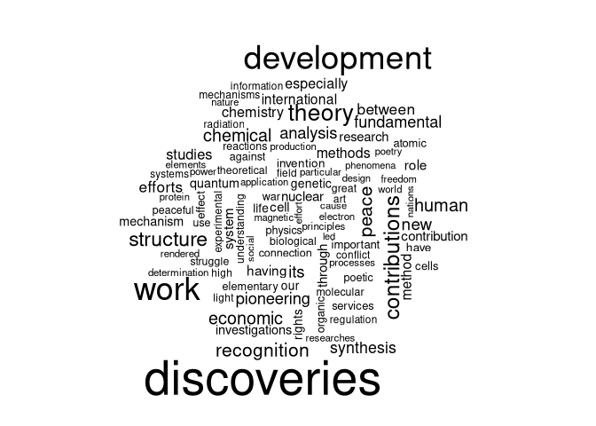

# HW5

\##Rest API

We will be retrieving data from the Nobel Prize REST API. We start by
loading some libraries

    library(jsonlite)
    library(tm)
    library(wordcloud)
    # library(snowballC)
    laurates <- fromJSON("http://api.nobelprize.org/2.1/nobelPrizes?limit=100000&nobelPrizeYear=1901&yearTo=2024")$nobelPrizes$laureates

Now we make a word cloud of the 100 most common words used in the
English language motivations. We extract the individual English language
motivations, put them in a vector, create a corpus, remove “common”/stop
words from said corpus and then create a wordcloud.

    motivations <- c()

    for(i in 1:length(laurates)) {
     motivations <- append(motivations, laurates[[i]]$motivation$en)
    }
    corpus <- Corpus(VectorSource(motivations))
    clean_corpus <- tm_map(corpus, removeWords, c("the","and","for","their","his","her","which","with","has","who","they","that","into","are"))

    ## Warning in tm_map.SimpleCorpus(corpus, removeWords, c("the", "and", "for", : transformation drops
    ## documents

    wordcloud(clean_corpus, max.words = 100)

    ## Warning in wordcloud(clean_corpus, max.words = 100): discovery could not be fit on page. It will not
    ## be plotted.

    ## Warning in wordcloud(clean_corpus, max.words = 100): concerning could not be fit on page. It will not
    ## be plotted.

## Web Scraping

In this sub-assigmnet we will be web scraping. We use the rvest library
to parse patterns in the HTML to get media database ID (upc?), title,
price and rating. To get the three first pages we rbind three calls to
our read\_url function.

    library(rvest)
    library(stringr)
    read_url <- function(url) {
      
      products <- read_html(url) %>% html_elements(".product_pod")

    ratings <- products %>% html_elements(".star-rating") %>% html_attr("class")
    titles <- products %>% html_elements("h3") %>% html_elements("a") %>% html_attr("title")
    prices <- products %>% html_elements("div.product_price") %>% html_elements("p.price_color") %>% html_text()

    upcs <- products %>% html_elements("div.image_container") %>% html_elements("a") %>% html_elements("img") %>% html_attr("src")

    for(i in 1:length(upcs)) {
      upcs[i] <- str_split_1(str_split_1(upcs[i],"/")[5],pattern = fixed("."))[1]
      ratings[i] <- str_split_1(ratings[i],fixed(" "))[2]
    }

    return(data.frame(upc = upcs, rating = ratings, title = titles, price = prices))
    }

    books <- rbind(rbind(read_url("https://books.toscrape.com/"),read_url("https://books.toscrape.com/catalogue/page-2.html")),read_url("https://books.toscrape.com/catalogue/page-3.html"))
    books

    ##                                 upc rating
    ## 1  2cdad67c44b002e7ead0cc35693c0e8b  Three
    ## 2  260c6ae16bce31c8f8c95daddd9f4a1c    One
    ## 3  3eef99c9d9adef34639f510662022830    One
    ## 4  3251cf3a3412f53f339e42cac2134093   Four
    ## 5  bea5697f2534a2f86a3ef27b5a8c12a6   Five
    ## 6  68339b4c9bc034267e1da611ab3b34f8    One
    ## 7  92274a95b7c251fea59a2b8a78275ab4   Four
    ## 8  3d54940e57e662c4dd1f3ff00c78cc64  Three
    ## 9  66883b91f6804b2323c8369331cb7dd1   Four
    ## 10 5846057e28022268153beff6d352b06c    One
    ## 11 bef44da28c98f905a3ebec0b87be8530    Two
    ## 12 1048f63d3b5061cd2f424d20b3f9b666   Four
    ## 13 5b88c52633f53cacf162c15f4f823153   Five
    ## 14 94b1b8b244bce9677c2f29ccc890d4d2   Five
    ## 15 81c4a973364e17d01f217e1188253d5e   Five
    ## 16 54607fe8945897cdcced0044103b10b6  Three
    ## 17 553310a7162dfbc2c6d19a84da0df9e1    One
    ## 18 09a3aef48557576e1a85ba7efea8ecb7    One
    ## 19 0bbcd0a6f4bcd81ccb1049a52736406e    Two
    ## 20 27a53d0bb95bdd88288eaf66c9230d7e    Two
    ## 21                               72    One
    ## 22                               c8    Two
    ## 23                               59  Three
    ## 24                               2e   Five
    ## 25                               cc   Five
    ## 26                               6e  Three
    ## 27                               0b  Three
    ## 28                               da  Three
    ## 29                               98   Five
    ## 30                               41   Four
    ## 31                               7e   Five
    ## 32                               c5  Three
    ## 33                               7e   Five
    ## 34                               bb    One
    ## 35                               71   Five
    ## 36                               53  Three
    ## 37                               88    Two
    ## 38                               85    One
    ## 39                               5c   Four
    ## 40                               20    Two
    ## 41                               41  Three
    ## 42                               bd    Two
    ## 43                               05   Five
    ## 44                               46   Five
    ## 45                               e2    Two
    ## 46                               04    One
    ## 47                               15   Five
    ## 48                               3b   Four
    ## 49                               a2   Four
    ## 50                               8e  Three
    ## 51                               3b    One
    ## 52                               df    One
    ## 53                               86  Three
    ## 54                               dd   Four
    ## 55                               0a   Five
    ## 56                               e5    One
    ## 57                               a2    One
    ## 58                               f4    One
    ## 59                               b8   Four
    ## 60                               7f  Three
    ##                                                                                                                                                                              title
    ## 1                                                                                                                                                             A Light in the Attic
    ## 2                                                                                                                                                               Tipping the Velvet
    ## 3                                                                                                                                                                       Soumission
    ## 4                                                                                                                                                                    Sharp Objects
    ## 5                                                                                                                                            Sapiens: A Brief History of Humankind
    ## 6                                                                                                                                                                  The Requiem Red
    ## 7                                                                                                                               The Dirty Little Secrets of Getting Your Dream Job
    ## 8                                                                                          The Coming Woman: A Novel Based on the Life of the Infamous Feminist, Victoria Woodhull
    ## 9                                                                                   The Boys in the Boat: Nine Americans and Their Epic Quest for Gold at the 1936 Berlin Olympics
    ## 10                                                                                                                                                                 The Black Maria
    ## 11                                                                                                                                  Starving Hearts (Triangular Trade Trilogy, #1)
    ## 12                                                                                                                                                           Shakespeare's Sonnets
    ## 13                                                                                                                                                                     Set Me Free
    ## 14                                                                                                                         Scott Pilgrim's Precious Little Life (Scott Pilgrim #1)
    ## 15                                                                                                                                                       Rip it Up and Start Again
    ## 16                                                                                              Our Band Could Be Your Life: Scenes from the American Indie Underground, 1981-1991
    ## 17                                                                                                                                                                            Olio
    ## 18                                                                                                                           Mesaerion: The Best Science Fiction Stories 1800-1849
    ## 19                                                                                                                                                    Libertarianism for Beginners
    ## 20                                                                                                                                                         It's Only the Himalayas
    ## 21                                                                                                                                                                     In Her Wake
    ## 22                                                                                                                                                                 How Music Works
    ## 23 Foolproof Preserving: A Guide to Small Batch Jams, Jellies, Pickles, Condiments, and More: A Foolproof Guide to Making Small Batch Jams, Jellies, Pickles, Condiments, and More
    ## 24                                                                                                                                                      Chase Me (Paris Nights #2)
    ## 25                                                                                                                                                                      Black Dust
    ## 26                                                                                                                                                   Birdsong: A Story in Pictures
    ## 27                                                                     America's Cradle of Quarterbacks: Western Pennsylvania's Football Factory from Johnny Unitas to Joe Montana
    ## 28                                                                                                                                                  Aladdin and His Wonderful Lamp
    ## 29                                                                                                                           Worlds Elsewhere: Journeys Around Shakespeare’s Globe
    ## 30                                                                                                                                                                  Wall and Piece
    ## 31                                                                                                                      The Four Agreements: A Practical Guide to Personal Freedom
    ## 32                                                                                                       The Five Love Languages: How to Express Heartfelt Commitment to Your Mate
    ## 33                                                                                                                                                               The Elephant Tree
    ## 34                                                                                                                                                          The Bear and the Piano
    ## 35                                                                                                                                                                  Sophie's World
    ## 36                                                                                                                                                                     Penny Maybe
    ## 37                                                                                                                                  Maude (1883-1993):She Grew Up with the country
    ## 38                                                                                                                                                            In a Dark, Dark Wood
    ## 39                                                                                                                                                             Behind Closed Doors
    ## 40                                                                                                                                                  You can't bury them all: Poems
    ## 41                                                                                                                                                  Slow States of Collapse: Poems
    ## 42                                                                                                                                                           Reasons to Stay Alive
    ## 43                                                                                                                                                     Private Paris (Private #10)
    ## 44                                                                                                              #HigherSelfie: Wake Up Your Life. Free Your Soul. Find Your Tribe.
    ## 45                                                                                                                                                 Without Borders (Wanderlove #1)
    ## 46                                                                                                                                                                When We Collided
    ## 47                                                                                                                                                    We Love You, Charlie Freeman
    ## 48                                                                                                                                         Untitled Collection: Sabbath Poems 2014
    ## 49                                                                       Unseen City: The Majesty of Pigeons, the Discreet Charm of Snails & Other Wonders of the Urban Wilderness
    ## 50                                                                                                                                                                  Unicorn Tracks
    ## 51                                                                          Unbound: How Eight Technologies Made Us Human, Transformed Society, and Brought Our World to the Brink
    ## 52                                                                                                                         Tsubasa: WoRLD CHRoNiCLE 2 (Tsubasa WoRLD CHRoNiCLE #2)
    ## 53                                                                                                     Throwing Rocks at the Google Bus: How Growth Became the Enemy of Prosperity
    ## 54                                                                                                                                                                 This One Summer
    ## 55                                                                                                                                                                          Thirst
    ## 56                                                                                                                                     The Torch Is Passed: A Harding Family Story
    ## 57                                                                                                                                                 The Secret of Dreadwillow Carse
    ## 58                                                 The Pioneer Woman Cooks: Dinnertime: Comfort Classics, Freezer Food, 16-Minute Meals, and Other Delicious Ways to Solve Supper!
    ## 59                                                                                                                                                             The Past Never Ends
    ## 60                                                                                                                       The Natural History of Us (The Fine Art of Pretending #2)
    ##     price
    ## 1  £51.77
    ## 2  £53.74
    ## 3  £50.10
    ## 4  £47.82
    ## 5  £54.23
    ## 6  £22.65
    ## 7  £33.34
    ## 8  £17.93
    ## 9  £22.60
    ## 10 £52.15
    ## 11 £13.99
    ## 12 £20.66
    ## 13 £17.46
    ## 14 £52.29
    ## 15 £35.02
    ## 16 £57.25
    ## 17 £23.88
    ## 18 £37.59
    ## 19 £51.33
    ## 20 £45.17
    ## 21 £12.84
    ## 22 £37.32
    ## 23 £30.52
    ## 24 £25.27
    ## 25 £34.53
    ## 26 £54.64
    ## 27 £22.50
    ## 28 £53.13
    ## 29 £40.30
    ## 30 £44.18
    ## 31 £17.66
    ## 32 £31.05
    ## 33 £23.82
    ## 34 £36.89
    ## 35 £15.94
    ## 36 £33.29
    ## 37 £18.02
    ## 38 £19.63
    ## 39 £52.22
    ## 40 £33.63
    ## 41 £57.31
    ## 42 £26.41
    ## 43 £47.61
    ## 44 £23.11
    ## 45 £45.07
    ## 46 £31.77
    ## 47 £50.27
    ## 48 £14.27
    ## 49 £44.18
    ## 50 £18.78
    ## 51 £25.52
    ## 52 £16.28
    ## 53 £31.12
    ## 54 £19.49
    ## 55 £17.27
    ## 56 £19.09
    ## 57 £56.13
    ## 58 £56.41
    ## 59 £56.50
    ## 60 £45.22
