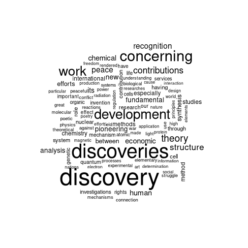

# HW5

##Rest API

We will be retrieving data from the Nobel Prize REST API. We start by loading some libraries


``` r
library(jsonlite)
library(tm)
library(wordcloud)
# library(snowballC)
laurates <- fromJSON("http://api.nobelprize.org/2.1/nobelPrizes?limit=100000&nobelPrizeYear=1901&yearTo=2024")$nobelPrizes$laureates
```
Now we make a word cloud of the 100 most common words used in the English language motivations. We extract the individual English language motivations, put them in a vector, create a corpus, remove "common"/stop words from said corpus and then create a wordcloud.

``` r
motivations <- c()

for(i in 1:length(laurates)) {
 motivations <- append(motivations, laurates[[i]]$motivation$en)
}
corpus <- Corpus(VectorSource(motivations))
clean_corpus <- tm_map(corpus, removeWords, c("the","and","for","their","his","her","which","with","has","who","they","that","into","are"))
```

```
## Warning in tm_map.SimpleCorpus(corpus, removeWords, c("the", "and", "for", : transformation drops documents
```

``` r
wordcloud(clean_corpus, max.words = 100)
```



## Web Scraping
In this sub-assigmnet we will be web scraping. We use the rvest library to parse patterns in the HTML to get media database ID (upc?), title, price and rating. To get the three first pages we rbind three calls to our read_url function.

``` r
library(rvest)
library(stringr)
read_url <- function(url) {
  
  products <- read_html(url) %>% html_elements(".product_pod")

ratings <- products %>% html_elements(".star-rating") %>% html_attr("class")
titles_and_links <- products %>% html_elements("h3") %>% html_elements("a")

titles <- titles_and_links %>% html_attr("title")
links <- titles_and_links %>% html_attr("href")

prices <- products %>% html_elements("div.product_price") %>% html_elements("p.price_color") %>% html_text()

upcs <- products %>% html_elements("div.image_container") %>% html_elements("a") %>% html_elements("img") %>% html_attr("src")

for(i in 1:length(upcs)) {
  ratings[i] <- str_split_1(ratings[i],fixed(" "))[2]
}


return(data.frame(rating = ratings, title = titles, price = prices, links = links))
}

books <- rbind(rbind(read_url("https://books.toscrape.com/"),read_url("https://books.toscrape.com/catalogue/page-2.html")),read_url("https://books.toscrape.com/catalogue/page-3.html"))
```
Now that we have a dataframe containing the links to the individual product pages of the books we can find the UPCs. We will only do this for the requested books, to avoid spamming the website


``` r
library(tidyverse)
get_upc <- function(link) {
  to_read <- paste0("https://books.toscrape.com/",link)
  page <- read_html(to_read) %>% html_elements("td") %>% html_text()
  return(page[1])
}
get_upcs <- function(requested_links) {
  
  to_return <- c()
  
  for(i in 1:length(requested_links)) {
    to_return <- c(to_return, get_upc(requested_links[i]))
  }
  return(to_return)
}

desired_titles <- c("A Light in the Attic","Tipping the Velvet", "Soumission","Sharp Objects", "Sapiens: A Brief History of Humankind")

requested_books <- books %>% filter(title %in% desired_titles) %>% mutate(upc = get_upcs(links)) %>% relocate(upc, title, price, rating) %>% select(-links)

knitr::kable(requested_books)
```


|upc              |title                                 |price  |rating |
|:----------------|:-------------------------------------|:------|:------|
|a897fe39b1053632 |A Light in the Attic                  |£51.77 |Three  |
|90fa61229261140a |Tipping the Velvet                    |£53.74 |One    |
|6957f44c3847a760 |Soumission                            |£50.10 |One    |
|e00eb4fd7b871a48 |Sharp Objects                         |£47.82 |Four   |
|4165285e1663650f |Sapiens: A Brief History of Humankind |£54.23 |Five   |
