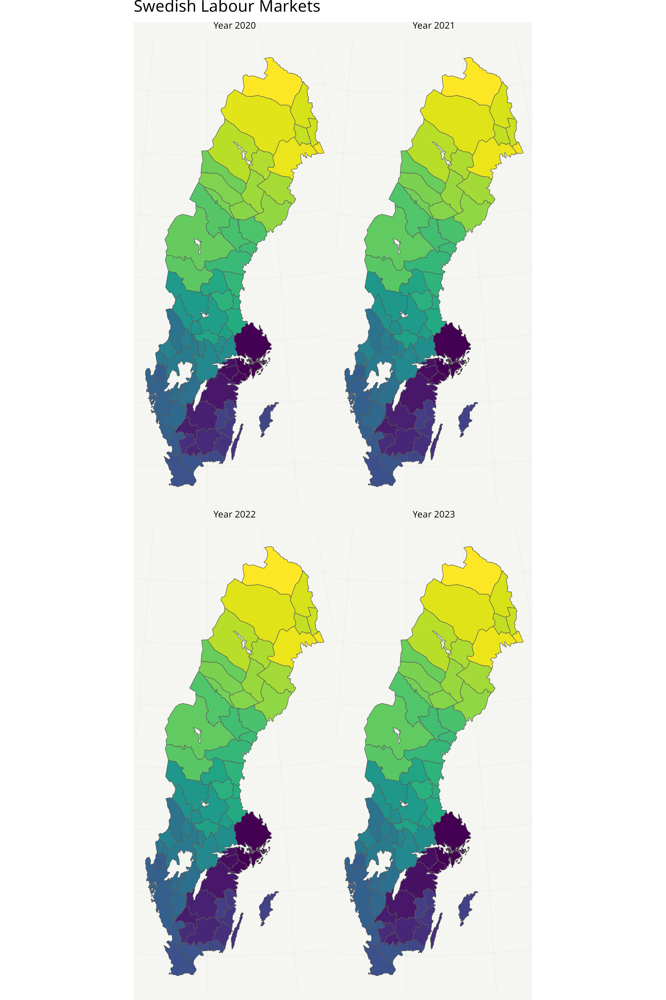

Does the Labour Market Subdivision Work?
================

## Introduction

The standard administrative subdivision of Sweden is Country -\> County
-\> Municipality. All of these have legal significance and their borders
have historically been determined by political decisions. Alongside the
standard administrative subdivisions Statistics Sweden (Statistiska
Centralbyrån) as well as other government agencies have created
subdivisions for statistical purposes, such as the Regional Statistical
Areas (RegSO), Demographic Statistical Areas (DeSO) and local labour
markets (lokala arbetsmarknader). I will in this post take a special
interest in the local labour market subdivision. The material is quite
technical (admittedly more than initially intended) so I envision the
primary target audience to be the people responsible for developing and
maintaining the local labour market standard in various countries.

The local labour markets are created by first determining which
municipalities can count as “local centers”. A local center is a
municipality in which

- at least 80% of the population works in it

- at most 7,5% of the population commutes to any other specific
  municipality

After the local centers are created all remaining municipalities are
assigned to the labour market created by the local center that most of
its commuting residents commute to. (Construction and use of labour
market areas in Sweden, Statistics Sweden 2010).

Quoting directly from the aforementioned SCB report: “The purpose of
local labour markets is to describe the functioning of the labour market
for geographical areas that are relatively independent of the outside
world with respect to supply and demand of labour” (translation my own,
original
[source](https://share.scb.se/ov9993/data/publikationer/statistik/_publikationer/am0207_2009a01_br_am95br1001.pdf)
in Swedish).

This post will ask and answer the question: Does this method of
subdivision work by testing whether or not the local labour markets are
mostly independent of the outside world. To perform this test this I
will analyse how this subdivision type interacted with the COVID-19
pandemic.

## The COVID-19 pandemic - A novel stress test

In 2020 the COVID pandemic swept over the world, with Sweden being no
exception. It is perhaps the best monitored and documented pandemic in
the history of the world. In particular, the granular data collected by
the Swedish Public Health Agency (Folkhälsomyndigheten) provides an
excellent opportunity to test if the labour market regions live up to
their purpose of being “relatively independent of the outside world”

If labour market regions are truly independent economic units we would
expected COVID-19 spread patterns between adjacent labour markets to be
less correlated than say, between counties (whose borders are not drawn
with the explicit purpouse of defining self contained economic zones)

This formulation will lead the layman to ask questions such as “What
counts as ‘less correlated’” and the expert asking questions such as
“How do we define ‘correlation’”. I will make explicit my modeling
assumptions later in the post, but first, let us visualise the spread of
COVID through Swedish municipalities. While I wish to keep the amount of
code displayed to a minimum, credit is due to Filip Wästberg for the
creation of the R package “swemaps2”, which I make heavy use of.

``` r
library(remotes)
remotes::install_github("filipwastberg/swemaps2")
```

Now that we have installed swemaps2 we can make a map of Swedens labour
market regions. They changed ever so slightly during the pandemic, so we
will have to account for that in our modeling.

``` r
source("geometry_functions.R")
library(openxlsx)
library(patchwork)
library(grid)
library(gridExtra)
labour_market_plots <- list()
for(i in 1:4) {
  labour_market_regions <- read.xlsx("la.xlsx", sheet = i)
  
  labour_market_geometry <- generate_labour_market_geometry(labour_market_regions)
  current_plot <- ggplot(labour_market_geometry, aes(fill=name)) +
    geom_sf() +
    scale_fill_viridis_d() +
    theme_swemap2() +
    theme(
      legend.position = "none",
      plot.subtitle = element_text(size = 8, hjust = 0.5)
    ) +
    labs(subtitle = paste("Year", 2019+i))
    
  labour_market_plots <- append(labour_market_plots, list(current_plot))
}

ggsave("la_markets.png",
       wrap_plots(labour_market_plots, ncol = 2, spacing = 0) +
         plot_annotation(
           title = "Swedish Labour Markets",
           theme = theme(
             plot.title = element_text(size = 14, hjust = 0),
             plot.margin = unit(c(0, 0, 0, 0), "cm")
           )
         ) & 
         theme(
           plot.margin = unit(c(0, 0, 0, 0), "cm")
         ),
       height = 12,
       width = 8,
       dpi = 300,bg = "white")
```

<figure>

<figcaption aria-hidden="true">Swedish labour markets, 2020 -
2023</figcaption>
</figure>

``` r
municipality_populations <- population_px_data_frame %>% filter(age == "tot") %>% mutate(year_index = as.numeric(year) - 2019) %>% select(-year) %>% group_by(year_index,region) %>% rename(population = Number ) %>% summarise(population = sum(population))
```

``` r
source("parsing_functions.R")
cases_frame <- read.csv("cases.csv", sep = ";")
cases_frame <- cases_frame %>% mutate(municipal_code = parse_municipality_name(Kommun))
cases_frame <- cases_frame %>% pivot_longer(cols = -c(Kommun, municipal_code))
cases_frame <- cases_frame %>% mutate(time = parse_timestamps(name))
cases_frame <- cases_frame %>% mutate(year_index = times_to_years(time))
cases_frame <- merge(cases_frame, municipality_populations, by.x = c("municipal_code", "year_index"), by.y = c("region", "year_index"))
```

<figure>

<figcaption aria-hidden="true">Geographic evolution of the COVID-19
pandemic</figcaption>
</figure>

While certainly pretty it would be hard to discern any meaningful
patterns by just peering over these visualisations, even if we were to
overlay the borders of our subdivisions of interest. This creates the
need for a good statistical model to estimate the effect adjacent labour
markets have on each other. We also need to answer the question of what
counts as a strong relationship, and how this relationship will be
measured.

## Modeling

The most appropriate model from my limited experience and understanding
would probably be zero-inflated negative binomial regression. However,
to avoid having to verify complicated modeling assumptions in an area
where I lack expertise, as well as the computational cost of fitting
such a model I have instead resorted to the following:

We first define our modeling target, which will be the log geometric
change in cases in a municipality between time (measured in weeks) $t$
and $t-1$. We call this
$[\text{log case ratio}]_{i,t} = \log\frac{\text{cases in municipality i at time t}}{\text{cases in municipality i at time t-1}}$.
The reason we set our modeling target to the log geometric change in
cases is partially to avoid having to model count data and partially to
avoid (or at least reduce) the autocorrelation of case counts over time.
With our modeling target defined we can now define our model, which will
be

$[\text{log case ratio}]_{i,t} = \alpha + \beta\mathbf{1}_{time = t} + \gamma\mathbf{1}_{\text{labour market of municipality i}} + \epsilon_{i,t}$.

This represents a fixed effects model with a time effect and a labour
market effect.

We have defined our modeling target, great. But now to the question of
what counts as a “weak relationship” between adjacent labour markets. A
priori we have very limited information about how such a relationship
would look, so to gain information we will run the same model but using
adjacent counties instead. In theory county borders should be largely
unrelated (or at least less related) to labour market, since most county
borders stem from the Axel Oxenstierna county reform of 1614. While
Oxenstierna undeniably was a great statesman I doubt that he managed to
predict the structure of the Swedish labour market in the 21st century,
so his borders should serve as a good benchmark. This gives us the
“Oxenstierna” or county model

$[\text{log case ratio}]_{i,t} = \alpha + \beta\mathbf{1}_{time = t} + \gamma\mathbf{1}_{\text{county of municipality i}} + \epsilon_{i,t}$.

We will not pay too much attention to the standard modelling assumptions
of linear regression (conditionally independent response variable, iid
normal errors with constant variance) since we will not be performing
frequentist tests or relying on the likelihood. Instead, we will measure
the correlation of the models residuals to the log case count in
adjacent labour markets/counties.

It may seem counterintuitive, but if labor market regions are truly
functioning as independent units, we would expect adjacent regions to
have less predictive power for COVID-19 spread compared to the
predictive power of a county based model.

To make this comparison we will need to handle both the fact that the
amount of labour market regions changed and that the constituent
municipalities changed during the pandemic. There were 69 labour market
regions in 2020, which shrunk to 67 for 2021 - 2023 (perhaps due to
decreased travel caused by the pandemic). We also have to handle that
2020 was a leap year with 53 weeks. I have also decided to use the 2023
labour market regions for 2024 since the updated ones were not available
at the time of writing. Finally, we will also have to remove Gotland
since it both as a labour market and as a county lacks adjacent labour
markets / counties, making models including it un-identifiable.

``` r
la_tagged_cases_frame <- tag_municipalities_years("la.xlsx",cases_frame,time_to_year)
tagged_cases_frame <- tag_county(la_tagged_cases_frame)
tagged_cases_frame <- tagged_cases_frame %>% select(municipal_code, value, time, Kod, county,year_index, population) %>% rename(cases = value, la_region = Kod)
```

``` r
tagged_cases_frame <- tagged_cases_frame %>% filter(municipal_code != "0980")
```

``` r
source("geometry_functions.R")
la_adjacency_frame <- data.frame()


for(j in 1:4) {

  labour_market <- read.xlsx("la.xlsx", sheet = j)
  la_sf <- generate_labour_market_geometry(labour_market)
  la_sf_adjacency <- generate_adjacency_dataframe(la_sf)
  
  current_tagged_cases_frame <- tagged_cases_frame %>% filter(year_index == j)
  adjacent_cases <- rep(0,nrow(current_tagged_cases_frame))
  
  
  for(i in 1:nrow(current_tagged_cases_frame)) {
    
    current_la_region <- current_tagged_cases_frame$la_region[i]
    
    
    current_labour_market_adjacency <- la_sf_adjacency %>% 
      filter(name == current_la_region) 

    current_time <- current_tagged_cases_frame$time[i]
    current_time_frame <- current_tagged_cases_frame %>% 
      filter(time == current_time)
  
    adjacency_filter <- as.logical(current_labour_market_adjacency[1,1:(ncol(current_labour_market_adjacency)-1)])
  
    adjacent_cases[i] <- sum(current_time_frame[adjacency_filter,]$cases)
    
  
  }
  current_tagged_cases_frame$adjacent_cases <- adjacent_cases
  la_adjacency_frame <- rbind(la_adjacency_frame, current_tagged_cases_frame)
}
```

``` r
county_adjacency_frame <- data.frame()
county_sf_adjacency <- generate_adjacency_dataframe(county)
county_sf_adjacency$ln_kod <- county$ln_kod
for(j in 1:4) {
  

  current_tagged_cases_frame <- tagged_cases_frame %>% filter(year_index == j)
  adjacent_cases <- rep(0,nrow(current_tagged_cases_frame))

  
  for(i in 1:nrow(current_tagged_cases_frame)) {
    
    current_county <- current_tagged_cases_frame$county[i]
    current_county_adjacency <- county_sf_adjacency %>% 
      filter(ln_kod == current_county) 
    
    current_time <- current_tagged_cases_frame$time[i]
    current_time_frame <- current_tagged_cases_frame %>% 
      filter(time == current_time)
  
    adjacency_filter <- as.logical(current_county_adjacency[1,1:(ncol(current_county_adjacency)-1)])
  
    adjacent_cases[i] <- sum(current_time_frame[adjacency_filter,]$cases)
    
  
  }
  current_tagged_cases_frame$adjacent_cases <- adjacent_cases
  county_adjacency_frame <- rbind(county_adjacency_frame, current_tagged_cases_frame)
}
```

``` r
compound_la_adjacency_frame <- rbind(week_on_week_case_ratios(la_adjacency_frame %>% filter(year_index == 1)), week_on_week_case_ratios(la_adjacency_frame %>% filter(year_index == 2)), week_on_week_case_ratios(la_adjacency_frame %>% filter(year_index == 3)), week_on_week_case_ratios(la_adjacency_frame %>% filter(year_index == 4)))

compound_county_adjacency_frame <- rbind(week_on_week_case_ratios(county_adjacency_frame %>% filter(year_index == 1)), week_on_week_case_ratios(county_adjacency_frame %>% filter(year_index == 2)), week_on_week_case_ratios(county_adjacency_frame %>% filter(year_index == 3)), week_on_week_case_ratios(county_adjacency_frame %>% filter(year_index == 4)))
```

Several hundred lines of cumbersome data wrangling later and we are
finally ready to run our models, which are shown in the code below

We will start by computing Spearmans $\rho$ for each municipality and
plotting it

``` r
source("correlation_functions.R")

la_anova_model <- lm(log(case_ratios) ~ as.factor(time) + as.factor(la_region), data = compound_la_adjacency_frame)
county_anova_model <- lm(log(case_ratios) ~ as.factor(time) + as.factor(county), data = compound_county_adjacency_frame)

compound_la_adjacency_frame$fe_residuals <- resid(la_anova_model)
compound_county_adjacency_frame$fe_residuals <- resid(county_anova_model)


la_municipal_correlations <- municipal_correlations(compound_la_adjacency_frame)
county_municipal_correlations <- municipal_correlations(compound_county_adjacency_frame)

la_municipal_correlations <- merge(la_municipal_correlations, municipality, by.x = "municipal_code", by.y = "kn_kod")
county_municipal_correlations <- merge(county_municipal_correlations, municipality, by.x = "municipal_code", by.y = "kn_kod")

la_correlation_plot <- ggplot(la_municipal_correlations, 
    aes(geometry=geometry, fill=srho)) + 
    geom_sf() + 
    common_fill_scale +
    theme_swemap2() + 
    theme(
        plot.title = element_text(size = 10, hjust = 0.5),
        plot.margin = margin(5, 5, 5, 5),
        aspect.ratio = 2  # For Sweden's proportions
    ) +
    labs(title = "LA model")

county_correlation_plot <- ggplot(county_municipal_correlations, 
    aes(geometry=geometry, fill=srho)) + 
    geom_sf() + 
    common_fill_scale +
    theme_swemap2() + 
    theme(
        plot.title = element_text(size = 10, hjust = 0.5),
        plot.margin = margin(5, 5, 5, 5),
        aspect.ratio = 2
    ) +
    labs(title = "Oxenstierna/county model")

combined_plot <- la_correlation_plot + county_correlation_plot + 
    plot_layout(guides = "collect", widths = c(1, 1)) & 
    theme(
        plot.title = element_text(size = 12, hjust = 0.5),
        legend.position = "right",  # Move legend to right
        legend.justification = "left"  # Align legend with plots
    )
combined_plot <- combined_plot + 
    plot_annotation(
        title = "Spearman's correlation coefficients for municipalities",
        theme = theme(
            plot.title = element_text(size = 14, hjust = 0.5, margin = margin(b = 20))
        )
    )

combined_plot
```

<figure>

<figcaption aria-hidden="true">Spearman correlation of LA based model vs
county based model</figcaption>
</figure>

Again while the map form of visualisation certainly is pleasing to the
eye a histogram can’t hurt.

``` r
la_mean <- mean(la_municipal_correlations$srho)
county_mean <- mean(county_municipal_correlations$srho)

ggplot() + 
  geom_histogram(data = la_municipal_correlations, 
                 aes(x = srho, y = after_stat(count/sum(count)), fill = "LA Municipal"), 
                 alpha = 0.5, 
                 position = "identity") +
  geom_histogram(data = county_municipal_correlations, 
                 aes(x = srho, y = after_stat(count/sum(count)), fill = "County Municipal"), 
                 alpha = 0.5, 
                 position = "identity") +
  geom_vline(aes(xintercept = la_mean),
             color = "blue",
             linetype = "dashed", 
             size = 1) +
  geom_vline(aes(xintercept = county_mean),
             color = "red",
             linetype = "dashed", 
             size = 1) +
  labs(title = "Distribution of Spatial Correlations",
       x = "Spatial Correlation (ρ)",
       y = "Frequency",
       fill = "Dataset") +
  theme_minimal()
```

<!-- -->

## Conclusions

The rank correlations for the county based model show a fatter right
tail and mean shifted to the right of the labour market model,
consistent with that labour markets should be mostly independent
entities. Directionally, the relationship is consistent with SCBs goals,
and a paired T-test of the rank correlations gives us a p value in the
$10^{-12} - 10^{-11}$ range indicating it is unlikely due to randomness.

``` r
t.test(la_municipal_correlations$srho, county_municipal_correlations$srho, paired = TRUE)
```

    ## 
    ##  Paired t-test
    ## 
    ## data:  la_municipal_correlations$srho and county_municipal_correlations$srho
    ## t = -7.1834, df = 288, p-value = 5.833e-12
    ## alternative hypothesis: true mean difference is not equal to 0
    ## 95 percent confidence interval:
    ##  -0.02842593 -0.01619887
    ## sample estimates:
    ## mean difference 
    ##      -0.0223124

It is however hard to interpret if the effect size is any meaningful.
Initially I tried adding the adjacent cases as a parameter to our linear
model, but getting the dataset to adhere in any way to the necessary
modelling assumptions was almost impossible. Given more time I would
have created the a Zero Inflated Negative Binomial model.
